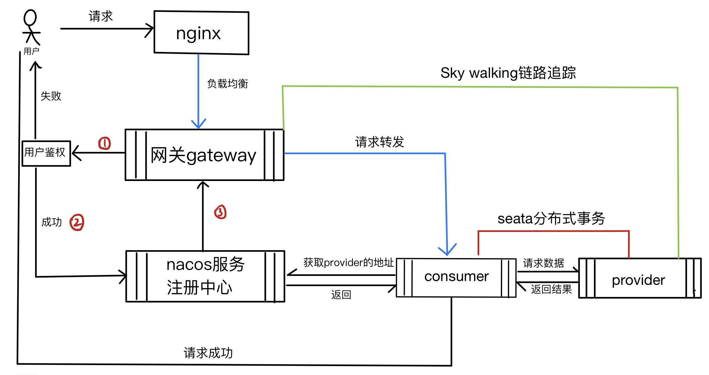
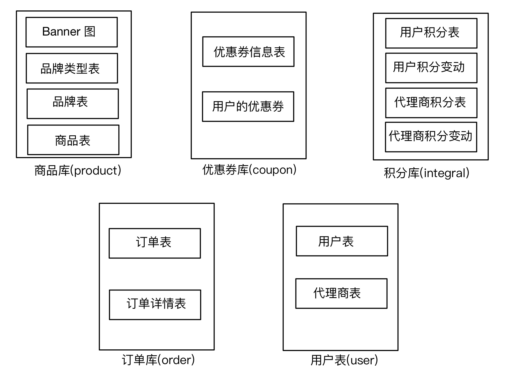

### 一、项目简介
- 用spring-cloud-alibaba框架模拟：服务注册与负载、配置中心，服务调用，服务熔断和降级，分布式事务，链路追踪等
- 请求流程图
  
- 数据库结构(分库)
  
### 二、技术栈
- cloud-alibabab: nacos sentinel seata
- db: mysql redis
- message queue: rabbitmq
- tracking: skywalking
### 三、nacos集群搭建与spring集成
https://juejin.cn/post/6928936563296436232
### 四、Sentinel的使用
https://juejin.cn/post/6942023355889352711

